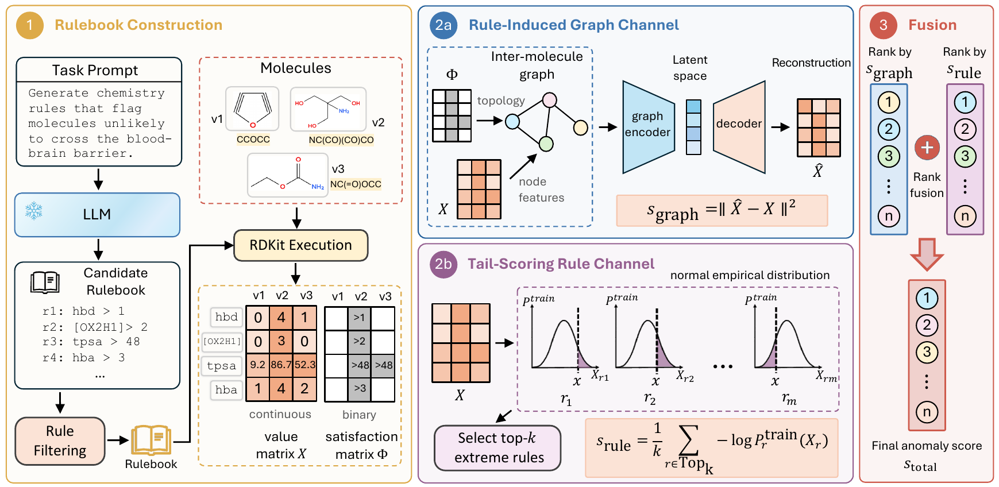

# ChemRuleAD



*ChemRuleAD architecture. A frozen LLM authors task-specific chemistry rules, and a graph-attention autoencoder over an inter-molecule graph (graph channel) plus a tail scorer over raw rule values (rule channel) are fused by rank sum.*

## File Structure

```
chemrulead/
├── data.py
├── model.py
├── main.py
├── requirements.txt
├── rulegen/
│   ├── generate.py
│   ├── filter.py
│   ├── rule_schema.py
│   └── prompts/
├── data/
│   └── <dataset>_<task>_seed<seed>.json
└── rules/
    ├── filtered/
    │   └── <dataset>_<task>.json
    ├── raw/
    └── generic_rules/
        └── k_match/
            └── <dataset>_<task>.json
```

Beyond the rule-generation and anomaly-detection code, this repository also provides the fixed dataset splits (`data/`), the prompts (`rulegen/prompts/`), and the generated rules (`rules/`). 

**Data split format.** Normal molecules are split 9:1 into a training set and a held-out normal set; the test set combines the held-out normals with all anomaly molecules. 

```json
{
  "train_normal": ["CCO", "c1ccccc1O"],
  "test": ["c1ccccc1", "CC(=O)Nc1ccc(O)cc1"],
  "test_labels": [0, 1]
}
```


**Rulebook format.** Produced by the rule-generation pipeline.

```json
{
  "rules": [
    {
      "name": "hba_high",
      "type": "descriptor",
      "descriptor": "hba",
      "direction": "higher",
      "confidence": 0.7,
      "description": "Increased hydrogen bond acceptors for target interaction",
    }
  ]
}
```

## Dependencies

```
pip install -r requirements.txt
```

Python 3.9 or newer.

## Generate rulebooks

Rule generation runs Qwen3-4B-Instruct-2507 locally and proceeds in two stages, including generating and filtering.

1. Author candidate rules into `rules/raw/`.

   ```
   python rulegen/generate.py          
   ```

2. Filter the raw rules into the rulebooks the detector reads.

   ```
   python rulegen/filter.py
   ```

   This reads `rules/raw/` and writes `rules/filtered/`.

## Run the detector

Run from this directory so that the detector modules and the `rulegen` package are found.

```
python main.py --data-dir ./data --out results.json
```

Optional:

```
python main.py --data-dir ./data --datasets BBBP ClinTox --seeds 42 123
```

For each task the command prints the graph-only, rule-only, and fused ChemRuleAD AUROC results, then reports per-dataset mean AUROCs.

## Reproducing the main results

The command reproduces the ChemRuleAD numbers in the paper's main table (**Table I**) and the channel breakdown (**Table II**).

```
python main.py --data-dir ./data --out results.json
```

Expected mean AUROC over the five seeds:

| Variant | BBBP | ClinTox | HIV | Tox21 | SIDER | Avg. |
| --- | --- | --- | --- | --- | --- | --- |
| ChemRuleAD-rule  | 0.8053 | 0.6867 | 0.6575 | 0.6543 | 0.5536 | 0.6715 |
| ChemRuleAD-graph | 0.8071 | 0.6985 | 0.6169 | 0.6496 | 0.5420 | 0.6628 |
| ChemRuleAD | 0.8411 | 0.7116 | 0.6442 | 0.6745 | 0.5509 | 0.6845 |

The paper also reports a generic-rules ablation (**Table IV**), where the task description is removed from the prompt, and the rulebook is matched to each task's rule count.

```
python main.py --rules rules/generic_rules/k_match --seeds 42
```

Expected generic-rules AUROC (seed 42):

| Variant | BBBP | ClinTox | HIV | Tox21 | SIDER | Avg. |
| --- | --- | --- | --- | --- | --- | --- |
| ChemRuleAD-rule | 0.7742 | 0.6452 | 0.6125 | 0.5728 | 0.5394 | 0.6288 |
| ChemRuleAD-graph | 0.7991 | 0.6958 | 0.6234 | 0.6330 | 0.5362 | 0.6575 |
| ChemRuleAD | 0.8166 | 0.6851 | 0.6235 | 0.6146 | 0.5391 | 0.6558 |
